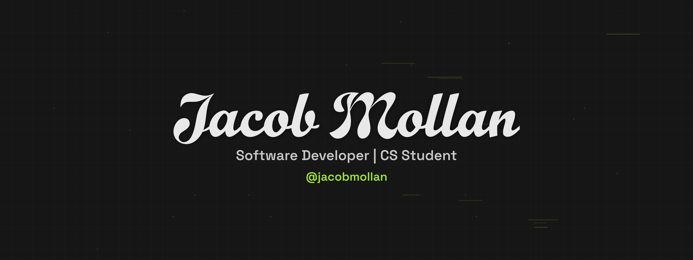

  

## About me

I’m a hobbyist developer going to study Computer Science at York St John University. I enjoy building things for fun and creating useful tools, and I share what I learn along the way. I focus on clear, readable code and practical results.

  
  

